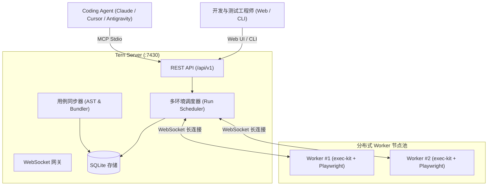

<div align="center">
  
  <h1>Tern（北极燕鸥）</h1>
  <p><b>面向 Coding Agent 的分布式 E2E 自动化测试平台</b></p>
  <p><i>pole to pole, end to end</i> —— 北极燕鸥一年往返两极约 7 万公里，是动物界极致的 end-to-end。</p>

  <p>
    <a href="https://github.com/zyf8827/tern/blob/main/LICENSE"></a>
    <a href="https://github.com/zyf8827/tern/actions/workflows/ci.yml"></a>
    <a href="https://nodejs.org"></a>
    <a href="https://pnpm.io"></a>
    <a href="https://modelcontextprotocol.io"></a>
  </p>

  <p>
    <b>简体中文</b> | <a href="./README_en.md">English</a>
  </p>
</div>

---

> ## 谁还用古法写用例？
>
> 自动化测试平台很少死于功能不够，大多死于**没人写用例与维护用例**：录制 selector、调登录、配环境，费时费力；前端页面稍一重构，旧用例集体飘红，久而久之平台积灰，**上线即巅峰**。
>
> Tern 的核心逻辑是：**写用例、跑测试、看现场截图、定位并修复重跑，这正是 Coding Agent 最擅长的工作。** Tern 把人机协作链路铺到最短：**人只为项目建一个 Git 用例仓库，写用例、排查与维护全量交给 Agent。**

```text
古法：登录测试平台 → 手工录用例 → 手配登录/环境 → 页面改版 selector 全挂 → 没空修 → 平台积灰
Tern：对 Agent 说「为用户与订单模块补全 E2E 用例」→ Agent 读源码直接写好 push → 经 MCP 驱动执行
      → 失败现场截图实时回传 Agent 多模态上下文 → 自动定位修复重跑 —— 全流程闭环
```

---

## 核心设计理念

| 维度           | 传统测试平台                       | Tern 现代化方案                                                                                                           |
| -------------- | ---------------------------------- | ------------------------------------------------------------------------------------------------------------------------- |
| **用例载体**   | 锁在平台数据库，通过网页表单增删改 | **代码库即用例库**：`cases/*.spec.ts` 普通源码存储，Git 统一版本化。平台只读索引，Case ID 决定性可预测                    |
| **测试语法**   | 学习平台私有 DSL 或低代码配置      | **原生 Playwright Test 语法** + 顶部 `@tern` frontmatter（tags/module/version/auth/devices），零学习成本                  |
| **登录与凭据** | 账号密码写死在用例或公共配置       | **声明式登录配方**（API / 表单 / 存储直写），凭据走 `${ENV:VAR}` 占位符，平台环境 **AES-256-GCM 加密存储且 API 永不回显** |
| **失败排查**   | 人工登录平台翻找日志和报告         | push 后 sync 报告即 lint/编译校验；MCP `wait` 语义一步阻塞并返回失败截图（**Image Content 直传**）、错误签名自动聚类      |
| **接入入口**   | 仅有人机交互的 Web UI              | **Web / CLI / MCP 三位一体**：人看 Web 实时进度与 Trace，CI/CD 调 CLI，Agent 经 MCP 全量调度                              |

---

## 1 分钟快速上手

### 1. 本地启动服务

```bash
# 1. 克隆代码并安装依赖
git clone https://github.com/zyf8827/tern.git
cd tern
pnpm install
pnpm -r build

# 2. 安装 Playwright 浏览器
npx playwright install chromium

# 3. 使用管理脚本一键启动（启动 Server 与 1 个本地 Worker）
bash scripts/dev.sh up 1

# 4. 打开管理端
open http://127.0.0.1:7430
```

### 2. Docker Compose 部署

```bash
# 交互式生成 docker-compose.yml 与 .env
bash scripts/init-compose.sh --yes

# 启动容器集群
docker compose up -d

# 检查服务健康
curl http://127.0.0.1:7430/api/v1/meta
```

---

## Coding Agent 接入（MCP & Skill）

Tern 专为 Coding Agent（Claude Code, Cursor, Windsurf, Antigravity, Zed 等）设计，提供开箱即用的 MCP Server 与官方 Agent Skill。

### 1. 配置 MCP Server

#### 方式 A：通过 npx 运行（推荐）

```json
{
  "mcpServers": {
    "tern": {
      "command": "npx",
      "args": ["-y", "@tern/mcp"],
      "env": {
        "TERN_URL": "http://127.0.0.1:7430"
      }
    }
  }
}
```

#### 方式 B：下载 GitHub Releases 预编译单文件产物

从 [Releases](https://github.com/zyf8827/tern/releases) 下载零依赖运行产物 `tern-mcp.mjs`（Node ≥ 20 直接运行）：

```json
{
  "mcpServers": {
    "tern": {
      "command": "node",
      "args": ["/path/to/tern-mcp.mjs"],
      "env": {
        "TERN_URL": "http://127.0.0.1:7430"
      }
    }
  }
}
```

> 详细 MCP 配置教程与 24+ 个工具使用说明请参阅 [docs/mcp.md](docs/mcp.md)。

---

### 2. 安装官方 Agent Skill（tern-project）

`tern-project` Skill 为 Coding Agent 注入自动化编写、维护与排查 Tern 用例的领域专业能力。

```bash
# 通过 skills CLI 安装
npx skills add https://github.com/zyf8827/tern.git --skill tern-project
```

_若使用 Claude Code 或其他 Agent，也可直接将主仓库中的 `skills/tern-project/` 复制到对应的 skills 目录。完整指引见 [docs/skills.md](docs/skills.md)。_

---

## 架构概览



- **极简自包含**：Server 仅需一个 Node.js 进程 + SQLite 单文件；Worker 仅需 Node.js 与 Playwright。
- **被动出站 Worker**：Worker 主动向 Server 建立 WebSocket 注册，易于穿透企业内网与容器网络。
- **设备反向代理**：内置设备代理，规避 Chromium secure context 限制，轻松在 HTTP 域名下测试麦克风与摄像头用例。
- **测试集多环境并跑**：一次运行可跨 dev/staging 多个环境并行触发，根据 `(用例 × 环境)` 自动精准去重。

> 完整系统架构与设计推导详见 [docs/architecture.md](docs/architecture.md)。

---

## 项目结构

```text
tern/
├── apps/
│   ├── server/       # 平台后端（Fastify + WebSocket + SQLite + 调度器 + 静态托管）
│   ├── worker/       # 分布式执行节点（WebSocket Client + 依赖缓存 + 状态上报）
│   ├── web/          # 前端控制台（React 18 + Vite + Tailwind CSS）
│   └── mcp/          # 官方 MCP Server (@tern/mcp)
├── packages/
│   ├── sdk/          # 平台共享类型与 API Client（零依赖叶子包）
│   ├── exec-kit/     # 执行管理层（Playwright runner 封装、auth 注入、产物采集）
│   ├── case-bundler/ # 用例 AST 解析、元数据校验与 esbuild 打包
│   └── cli/          # 命令行工具 (@tern/cli)
├── skills/
│   └── tern-project/ # 官方 Agent Skill（工作流规范、踩坑录与配方模板）
├── docker/           # Server 与 Worker Dockerfile（默认官方上游源）
├── docs/             # 平台设计文档、架构文档、MCP 与 Skill 指引
└── tests/fixtures/   # 合成测试资产与通用演示用例仓库
```

---

## 贡献与开源治理

欢迎提交 Issue 和 Pull Request！在参与贡献前，请先阅读：

- [贡献指南 (CONTRIBUTING.md)](CONTRIBUTING.md)
- [行为准则 (CODE_OF_CONDUCT.md)](CODE_OF_CONDUCT.md)
- [安全策略 (SECURITY.md)](SECURITY.md)
- [变更日志 (CHANGELOG.md)](CHANGELOG.md)

---

## 许可证 (License)

Tern 遵循 [Apache-2.0 License](LICENSE) 协议开源。
