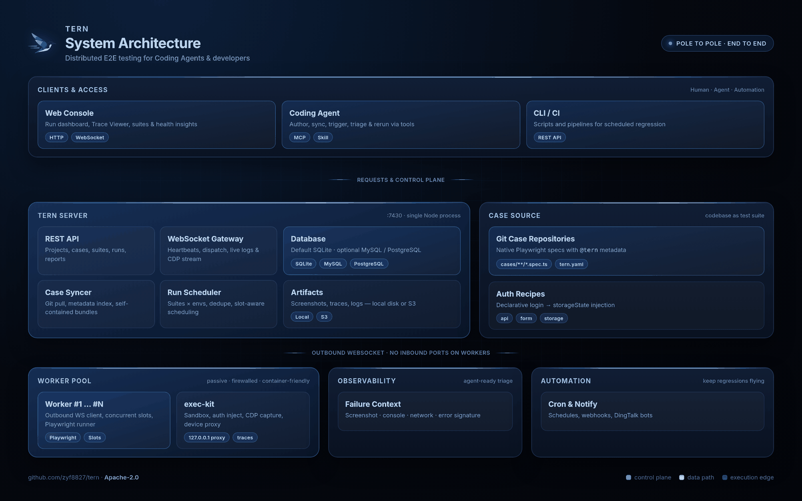

<div align="center">
  
  <h1>Tern（北极燕鸥）</h1>
  <p><b>面向 Coding Agent 与开发者的分布式 E2E 测试平台</b></p>
  <p><i>pole to pole, end to end</i> —— 一年往返两极约 7 万公里，从一极到另一极。</p>

  <p>
    <a href="https://github.com/zyf8827/tern/blob/main/LICENSE"></a>
    <a href="https://github.com/zyf8827/tern/actions/workflows/ci.yml"></a>
    <a href="https://nodejs.org"></a>
    <a href="https://pnpm.io"></a>
    <a href="https://registry.modelcontextprotocol.io/v0.1/servers?search=io.github.zyf8827/tern"></a>
    <a href="https://www.npmjs.com/package/@zyf8827/tern-mcp"></a>
  </p>

  <p>
    <b>简体中文</b> | <a href="./README_en.md">English</a>
  </p>
</div>

---

Tern 是一个轻量级、分布式的 E2E 测试平台，专为配合 Coding Agent（如 Claude Code、Cursor、Windsurf、Antigravity 等）与开发者协同工作设计。

在实际项目中，端到端测试最大的痛点通常是用例编写与长期维护的高昂人力成本。Tern 将用例放在独立的 Git 仓库中，通过原生 Playwright 编写；开发者只需定义项目的配置与契约，Coding Agent 即可通过 MCP 或 Skill 进行用例编写、同步拉取、触发执行、回传失败截图定位排查与重跑。

---

## 系统架构

<p align="center">
  
</p>

*面向 Coding Agent 与开发者的轻量分布式 E2E 测试架构。详见 [docs/architecture.md](docs/architecture.md)。*

---

## 核心特性

- **代码库即用例库**：测试用例直接保存在独立 Git 仓库的 `cases/**/*.spec.ts` 中。平台只读拉取与索引，不侵入源码，Case ID 按相对路径确定（如 `portal/order/checkout`）。
- **原生 Playwright 语法**：用例顶部通过 `@tern` 块注释标注元数据（`title`、`tags`、`module`、`version`、`auth`、`timeout`、`devices` 等），正文完全采用标准 Playwright Test API，无任何私有 DSL。
- **声明式登录配方（Auth Recipes）**：登录逻辑集中定义在用例仓库的 `tern.yaml`（支持 `api`、`form`、`storage` 三种模式），由 Worker 在测试执行前自动构建并注入 Playwright `storageState`；敏感凭据通过 `${ENV:VAR}` 占位符隔离，平台端加密存储（AES-256-GCM）且 API 永不回显。
- **测试集与多环境去重调度**：支持声明式测试集（Test Suite），一次测试运行可关联多个测试集，各自绑定不同的执行环境（如 dev / staging），平台按 `(用例 × 环境)` 组合精确去重并行派发。
- **被动出站 Worker**：Worker 节点主动向 Server 建立 WebSocket 长连接拉取任务，不监听外部入站端口，便于跨网络或容器化部署；支持并发槽位（Slots）限制。
- **排查与观测**：用例失败时自动记录控制台日志、请求信息、首张失败现场截图（MCP 工具可直接将图片回传 Agent 上下文）与 Playwright Trace；Web 控制台内嵌 Trace Viewer 支持在线回放，并支持错误特征签名聚类。
- **设备模拟与反向代理**：支持虚拟麦克风推流（PCM WAV），内置本机 `127.0.0.1` 反向代理，自动解决 HTTP 域名下 Chromium 限制 `getUserMedia` 权限的问题。
- **定时与通知**：支持 Cron 定时调度触发回归，支持通用 Webhook 与钉钉机器人发送运行结果通知。

## 数据库 (Database)
默认使用 SQLite (零配置, `data/platform.db`)。
如需使用 MySQL 或 PostgreSQL，可通过配置环境变量 `DB_DIALECT` 和 `DATABASE_URL`（或离散的 `DB_HOST`/`DB_PORT`/`DB_USER`/`DB_PASSWORD`/`DB_NAME`）实现。详见 [部署文档](docs/deploy.md)。

---

## 快速开始

### 1. 本地直接运行（推荐）

依赖准备：Node.js ≥ 20，pnpm 10。

```bash
# 克隆仓库并构建
git clone https://github.com/zyf8827/tern.git
cd tern
pnpm install
pnpm -r build

# 安装 Playwright 浏览器
npx playwright install chromium

# 使用管理脚本一键启动 Server 与 1 个本地 Worker
bash scripts/dev.sh up 1

# 访问 Web 管理端
# http://127.0.0.1:7430
```

常用命令：

- 查看服务状态：`bash scripts/dev.sh status`
- 查看日志：`bash scripts/dev.sh logs`
- 停止服务：`bash scripts/dev.sh down`

### 2. Docker Compose 运行

```bash
# 生成配置文件（.env 与 docker-compose.yml）
bash scripts/init-compose.sh --yes

# 启动容器
docker compose up -d

# 检查健康状态
curl http://127.0.0.1:7430/api/v1/meta
```

---

## Agent 接入（MCP & Skill）

### 1. 配置 MCP Server

Tern MCP Server 已发布至 npm（[`@zyf8827/tern-mcp`](https://www.npmjs.com/package/@zyf8827/tern-mcp)），并已在官方 [MCP Registry](https://registry.modelcontextprotocol.io/v0.1/servers?search=io.github.zyf8827/tern) 上架（`io.github.zyf8827/tern`）。

在你的 Coding Agent（Claude Code、Cursor、Windsurf、Zed 等）中配置：

```json
{
  "mcpServers": {
    "tern": {
      "command": "npx",
      "args": ["-y", "@zyf8827/tern-mcp"],
      "env": {
        "TERN_URL": "http://127.0.0.1:7430"
      }
    }
  }
}
```

> 也可以从 [Releases](https://github.com/zyf8827/tern/releases) 下载独立单文件产物 `tern-mcp.mjs`，通过 `node /path/to/tern-mcp.mjs` 运行。更多客户端配置及 27 个工具说明见 [docs/mcp.md](docs/mcp.md)。

### 2. 安装官方 Agent Skill

`tern-project` Skill 帮助 Coding Agent 掌握 Tern 用例工程规范、编写规范与排障套路：

```bash
npx skills add https://github.com/zyf8827/tern.git --skill tern-project
```

> 手动安装方式与详细说明见 [docs/skills.md](docs/skills.md)。

---

## 仓库结构

```text
tern/
├── apps/
│   ├── server/       # 调度服务端（Fastify + WebSocket + SQLite + 静态资源托管）
│   ├── worker/       # 测试执行节点（主动连 Server，跑 Playwright）
│   ├── web/          # 控制台界面（React + Vite + Tailwind CSS）
│   └── mcp/          # MCP 服务实现（@zyf8827/tern-mcp）
├── packages/
│   ├── sdk/          # 共享类型与 API Client（@tern/sdk）
│   ├── exec-kit/     # Worker 执行套件与 Playwright runner 封装（@tern/exec-kit）
│   ├── case-bundler/ # 用例 frontmatter 解析与 esbuild 打包（@tern/case-bundler）
│   └── cli/          # 命令行工具（@tern/cli）
├── skills/
│   └── tern-project/ # Agent Skill（用例仓库模板与规约）
├── scripts/          # 本地运维与开发脚本（dev.sh、init-compose.sh 等）
└── docs/             # 详细技术文档
```

---

## 文档索引

- [系统架构设计 (docs/architecture.md)](docs/architecture.md)
- [Agent 协作指南 (AGENTS.md)](AGENTS.md)
- [MCP 接入指南 (docs/mcp.md)](docs/mcp.md)
- [Agent Skill 说明 (docs/skills.md)](docs/skills.md)
- [Docker 部署指南 (docs/deploy.md)](docs/deploy.md)
- [登录态与凭据管理 (docs/auth-design.md)](docs/auth-design.md)
- [设备反向代理设计 (docs/device-proxy-design.md)](docs/device-proxy-design.md)
- [测试资产方案 (docs/test-assets-design.md)](docs/test-assets-design.md)
- [测试集功能设计 (docs/test-suite-design.md)](docs/test-suite-design.md)
- [更新日志 (CHANGELOG.md)](CHANGELOG.md)

---

## 许可证

本项目基于 [Apache-2.0](LICENSE) 许可证开源。
