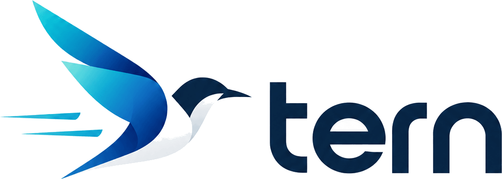

<div align="center">
  
  <h1>Tern</h1>
  <p><b>Distributed E2E Testing Platform for Coding Agents and Developers</b></p>
  <p><i>pole to pole, end to end</i> —— Arctic terns fly ~70,000 km between poles each year, from one pole to another.</p>

  <p>
    <a href="https://github.com/zyf8827/tern/blob/main/LICENSE"></a>
    <a href="https://github.com/zyf8827/tern/actions/workflows/ci.yml"></a>
    <a href="https://nodejs.org"></a>
    <a href="https://pnpm.io"></a>
    <a href="https://registry.modelcontextprotocol.io/v0.1/servers?search=io.github.zyf8827/tern"></a>
    <a href="https://www.npmjs.com/package/@zyf8827/tern-mcp"></a>
  </p>

  <p>
    <a href="./README.md">简体中文</a> | <b>English</b>
  </p>
</div>

---

Tern is a lightweight, distributed end-to-end testing platform designed to work alongside Coding Agents (such as Claude Code, Cursor, Windsurf, Antigravity) and developers.

In real-world engineering, the primary barrier in E2E testing is the heavy cost of writing and continuously maintaining test cases. Tern keeps test cases in independent Git repositories written with native Playwright. Developers define the project contract and environment configs, while Coding Agents author, sync, execute, troubleshoot using failure screenshots, and re-run tests via MCP or Skill integrations.

---

## Core Features

- **Codebase as Test Suite**: Test cases live in standalone Git repositories under `cases/**/*.spec.ts`. The platform reads and indexes them without mutating source code; Case IDs are deterministically resolved by file path (e.g. `portal/order/checkout`).
- **Native Playwright Syntax**: Test cases specify metadata (`title`, `tags`, `module`, `version`, `auth`, `timeout`, `devices`, etc.) in top-of-file `@tern` block comments. Test bodies use standard Playwright Test APIs with zero private DSL lock-in.
- **Declarative Auth Recipes**: Authentication flows are declared in `tern.yaml` (`api`, `form`, or `storage` modes) and injected as Playwright `storageState` by workers before execution. Secrets use `${ENV:VAR}` placeholders and are stored encrypted (AES-256-GCM) on the platform, never echoed via API.
- **Test Suites & Multi-Environment Scheduling**: Named test suites combine selectors and environment bindings. A single run can trigger multiple suites across different environments (e.g. dev, staging), automatically deduplicating execution by `(case × environment)`.
- **Passive Outbound Workers**: Worker nodes initiate outbound WebSocket connections to the Server without requiring open inbound ports, simplifying cross-network and containerized deployment with slot-based concurrency.
- **Observability & Troubleshooting**: Automatic capture of console logs, network requests, first failure screenshots (returned as image content to Agent context), and Playwright Traces. Web dashboard includes an embedded Trace Viewer and failure error signature clustering.
- **Device Simulation & Reverse Proxy**: Supports simulated microphone audio streaming (PCM WAV) with a built-in `127.0.0.1` reverse proxy to overcome Chromium's `getUserMedia` secure context constraints on HTTP hosts.
- **Schedules & Webhooks**: Built-in 5-field Cron scheduler for automated regression, supporting generic HTTP Webhooks and DingTalk bots.

---

## Quick Start

### 1. Local Run (Recommended)

Requirements: Node.js ≥ 20, pnpm 10.

```bash
# Clone and build
git clone https://github.com/zyf8827/tern.git
cd tern
pnpm install
pnpm -r build

# Install Playwright browser
npx playwright install chromium

# Start Server and 1 local Worker via helper script
bash scripts/dev.sh up 1

# Access the Web Dashboard
# http://127.0.0.1:7430
```

Useful commands:

- Check status: `bash scripts/dev.sh status`
- View logs: `bash scripts/dev.sh logs`
- Stop processes: `bash scripts/dev.sh down`

### 2. Docker Compose Run

```bash
# Generate config (.env and docker-compose.yml)
bash scripts/init-compose.sh --yes

# Start containers
docker compose up -d

# Check health status
curl http://127.0.0.1:7430/api/v1/meta
```

---

## Coding Agent Integration (MCP & Skill)

### 1. Configure MCP Server

Tern MCP Server is published on npm ([`@zyf8827/tern-mcp`](https://www.npmjs.com/package/@zyf8827/tern-mcp)) and listed on the official [MCP Registry](https://registry.modelcontextprotocol.io/v0.1/servers?search=io.github.zyf8827/tern) (`io.github.zyf8827/tern`).

Configure in your Coding Agent (Claude Code, Cursor, Windsurf, Zed, etc.):

```json
{
  "mcpServers": {
    "tern": {
      "command": "npx",
      "args": ["-y", "@zyf8827/tern-mcp"],
      "env": {
        "TERN_URL": "http://127.0.0.1:7430"
      }
    }
  }
}
```

> Standalone single-file runner `tern-mcp.mjs` is also available on [Releases](https://github.com/zyf8827/tern/releases). See [docs/mcp.md](docs/mcp.md) for full client guides and 27 tool references.

### 2. Install Official Agent Skill

The `tern-project` Skill guides Coding Agents on case conventions, authoring best practices, and troubleshooting patterns:

```bash
npx skills add https://github.com/zyf8827/tern.git --skill tern-project
```

> See [docs/skills.md](docs/skills.md) for manual installation instructions.

---

## Repository Structure

```text
tern/
├── apps/
│   ├── server/       # Scheduling server (Fastify + WebSocket + SQLite + static web hosting)
│   ├── worker/       # Execution node (outbound WebSocket connection, runs Playwright)
│   ├── web/          # Dashboard (React + Vite + Tailwind CSS)
│   └── mcp/          # MCP server implementation (@zyf8827/tern-mcp)
├── packages/
│   ├── sdk/          # Shared types and API client (@tern/sdk)
│   ├── exec-kit/     # Worker runner and Playwright execution kit (@tern/exec-kit)
│   ├── case-bundler/ # Case frontmatter parser and esbuild bundler (@tern/case-bundler)
│   └── cli/          # Command line interface (@tern/cli)
├── skills/
│   └── tern-project/ # Agent Skill (repository templates and conventions)
├── scripts/          # Development and deployment scripts (dev.sh, init-compose.sh)
└── docs/             # Technical documentation
```

---

## Documentation Index

- [System Architecture (docs/architecture.md)](docs/architecture.md)
- [Agent Operating Guide (AGENTS.md)](AGENTS.md)
- [MCP Integration Guide (docs/mcp.md)](docs/mcp.md)
- [Agent Skill Guide (docs/skills.md)](docs/skills.md)
- [Docker Deployment Guide (docs/deploy.md)](docs/deploy.md)
- [Auth Recipes Design (docs/auth-design.md)](docs/auth-design.md)
- [Device Proxy Design (docs/device-proxy-design.md)](docs/device-proxy-design.md)
- [Test Assets Scheme (docs/test-assets-design.md)](docs/test-assets-design.md)
- [Test Suite Design (docs/test-suite-design.md)](docs/test-suite-design.md)
- [Changelog (CHANGELOG.md)](CHANGELOG.md)

---

## License

Tern is open source software licensed under [Apache-2.0](LICENSE).
