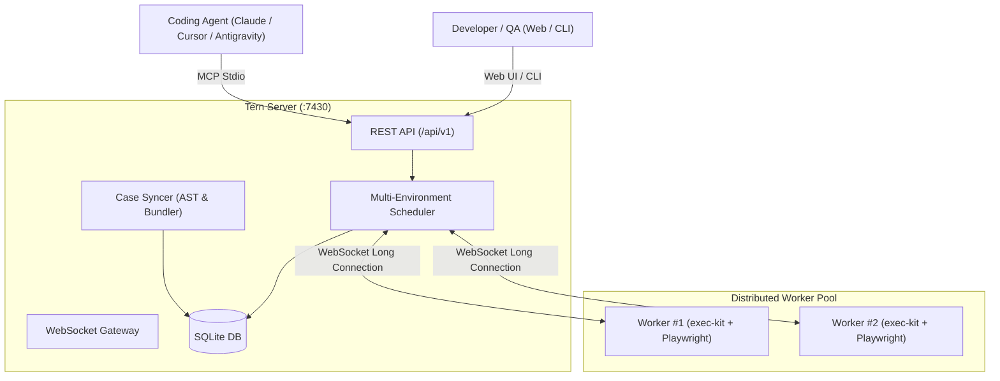

<div align="center">
  
  <h1>Tern</h1>
  <p><b>A Distributed E2E Testing Platform Built for Coding Agents</b></p>
  <p><i>pole to pole, end to end</i> — The Arctic Tern flies ~70,000 km between polar regions annually, the ultimate end-to-end journey in the animal kingdom.</p>

  <p>
    <a href="https://github.com/zyf8827/tern/blob/main/LICENSE"></a>
    <a href="https://github.com/zyf8827/tern/actions/workflows/ci.yml"></a>
    <a href="https://nodejs.org"></a>
    <a href="https://pnpm.io"></a>
    <a href="https://modelcontextprotocol.io"></a>
  </p>

  <p>
    <a href="./README.md">简体中文</a> | <b>English</b>
  </p>
</div>

---

> ## Why are tests still written manually?
>
> Automated test platforms rarely fail from a lack of features. They fail because **nobody writes or maintains the test cases**: recording selectors, configuring authentication, setting up environments—it is tedious and error-prone. The moment UI code is refactored, outdated tests fail en masse, and the platform gathers dust.
>
> Tern is built on a simple premise: **Reading source code, authoring tests, inspecting failure screenshots, diagnosing errors, and rerunning tests are tasks Coding Agents excel at.** Tern makes the loop minimal: **Humans create a Git repository for test cases; authoring, debugging, and maintenance are delegated entirely to Agents.**

```text
Traditional: Log in to platform → Click around to record tests → UI changes → Selectors break → Abandoned
Tern: Tell Agent "Write E2E tests for order flow" → Agent reads your repo, writes native Playwright specs, pushes
      → MCP executes tests → Failure screenshots returned directly to multimodal context → Agent fixes & reruns
```

---

## Core Philosophy

| Dimension                    | Traditional Testing Platforms               | Tern Modern Approach                                                                                                                                      |
| ---------------------------- | ------------------------------------------- | --------------------------------------------------------------------------------------------------------------------------------------------------------- |
| **Case Storage**             | Locked inside proprietary database UI       | **Codebase is the Case Repository**: Native `cases/*.spec.ts` in Git. Read-only indexing by platform; predictable Case IDs                                |
| **Test Syntax**              | Proprietary DSL or fragile low-code wizards | **Native Playwright Test Syntax** + top `@tern` frontmatter (tags/module/version/auth/devices); zero learning curve                                       |
| **Authentication & Secrets** | Hardcoded passwords in scripts              | **Declarative Auth Recipes** (API, Form, Storage); credentials isolated with `${ENV:VAR}`, stored with **AES-256-GCM encryption**, never returned via API |
| **Failure Diagnosis**        | Humans digging through log files            | Push triggers sync lint report; MCP `wait` semantics block until finish; **direct Image Content failure screenshots** & error signature clustering        |
| **Interface**                | Web UI only                                 | **Unified Web / CLI / MCP Interface**: Web for visual monitoring, CLI for CI/CD pipelines, MCP for Agent automation                                       |

---

## 1-Minute Quickstart

### 1. Local Development Setup

```bash
# 1. Clone repository and install dependencies
git clone https://github.com/zyf8827/tern.git
cd tern
pnpm install
pnpm -r build

# 2. Install Playwright browsers
npx playwright install chromium

# 3. Start Server and 1 Worker using dev manager script
bash scripts/dev.sh up 1

# 4. Open Web Console
open http://127.0.0.1:7430
```

### 2. Docker Compose Deployment

```bash
# Generate docker-compose.yml and .env interactively
bash scripts/init-compose.sh --yes

# Start containers
docker compose up -d

# Verify health
curl http://127.0.0.1:7430/api/v1/meta
```

---

## Coding Agent Integration (MCP & Skill)

Tern provides official Model Context Protocol (MCP) server integration and an Agent Skill for Claude Code, Cursor, Windsurf, Antigravity, and Zed.

### 1. Configure MCP Server

#### Option A: Run via npx (Recommended)

```json
{
  "mcpServers": {
    "tern": {
      "command": "npx",
      "args": ["-y", "@zyf8827/tern-mcp"],
      "env": {
        "TERN_URL": "http://127.0.0.1:7430"
      }
    }
  }
}
```

#### Option B: Standalone Runner from GitHub Releases

Download `tern-mcp.mjs` (single-file runner, Node.js ≥ 20) from [Releases](https://github.com/zyf8827/tern/releases):

```json
{
  "mcpServers": {
    "tern": {
      "command": "node",
      "args": ["/path/to/tern-mcp.mjs"],
      "env": {
        "TERN_URL": "http://127.0.0.1:7430"
      }
    }
  }
}
```

> See [docs/mcp.md](docs/mcp.md) for detailed configuration guide and 24+ tool references.

---

### 2. Install Official Agent Skill (tern-project)

The `tern-project` skill teaches your Coding Agent how to build case repositories, write compliant frontmatter, configure auth recipes, and diagnose errors.

```bash
# Install via skills CLI
npx skills add https://github.com/zyf8827/tern.git --skill tern-project
```

_For manual installation or custom agent directories, see [docs/skills.md](docs/skills.md)._

---

## Architecture Overview



- **Minimalist & Self-Contained**: Server runs on 1 Node.js process + 1 SQLite file; Worker runs on 1 Node.js process + Playwright browser.
- **Outbound Passive Workers**: Workers connect outward to Server over WebSocket, easily traversing private networks and firewalls.
- **Built-in Device Proxy**: Resolves Chromium `getUserMedia` secure context constraints for media tests over plain HTTP.
- **Multi-Environment Test Suites**: Trigger runs across multiple environments simultaneously with automatic deduplication by `(case × env)`.

> For deep architectural design, see [docs/architecture.md](docs/architecture.md).

---

## Repository Structure

```text
tern/
├── apps/
│   ├── server/       # Platform backend (Fastify + WebSocket + SQLite + scheduler)
│   ├── worker/       # Execution node (WebSocket client + caching + status reporting)
│   ├── web/          # Management console (React 18 + Vite + Tailwind CSS)
│   └── mcp/          # Official MCP Server (@zyf8827/tern-mcp)
├── packages/
│   ├── sdk/          # Shared types and API client (zero-dependency leaf package)
│   ├── exec-kit/     # Execution harness (Playwright wrapper, auth injection, artifact capture)
│   ├── case-bundler/ # Case AST parser, metadata validation, esbuild bundler
│   └── cli/          # CLI tool (@tern/cli)
├── skills/
│   └── tern-project/ # Official Agent Skill
├── docker/           # Production Dockerfiles (defaulting to upstream registries)
├── docs/             # Technical architecture, MCP, Skill, and deployment guides
└── tests/fixtures/   # Synthetic fixtures and demo case repositories
```

---

## Contributing

We welcome issues and pull requests! Please review:

- [Contributing Guide (CONTRIBUTING.md)](CONTRIBUTING.md)
- [Code of Conduct (CODE_OF_CONDUCT.md)](CODE_OF_CONDUCT.md)
- [Security Policy (SECURITY.md)](SECURITY.md)
- [Changelog (CHANGELOG.md)](CHANGELOG.md)

---

## License

Tern is licensed under the [Apache-2.0 License](LICENSE).
