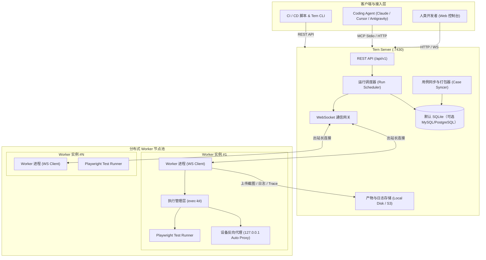
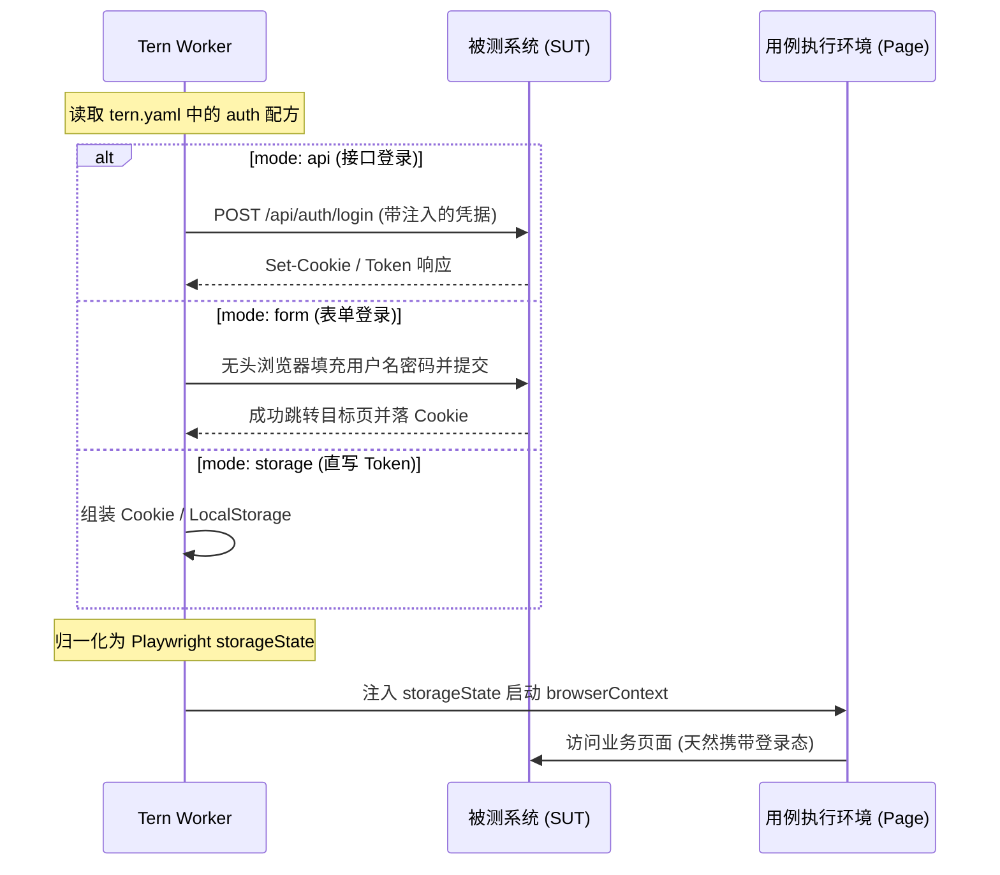

# Tern 架构设计与系统原理

Tern（北极燕鸥）是一个面向 Coding Agent 与开发者的分布式 E2E 测试平台。用例采用原生 Playwright Test 编写并保存在 Git 仓库中；平台负责用例同步索引、分布式调度执行、实时屏幕透传、失败归因分析与 MCP/API 接口暴露。

---

## 1. 核心设计原则

| 原则                              | 核心思想             | 说明                                                                                                                           |
| --------------------------------- | -------------------- | ------------------------------------------------------------------------------------------------------------------------------ |
| **P1. 代码库即用例库**            | 杜绝私有格式锁定     | 用例就是 Git 仓库中带 `@tern` frontmatter 的普通 `*.spec.ts` 文件；平台只负责扫描、打包与索引。                                |
| **P2. Web 管理端只读**            | 用例版本归属代码库   | Web 控制台不提供用例新建/在线编辑入口；所有用例生命周期均通过 Git 提交（由工程师或 Coding Agent 完成）。                       |
| **P3. 极简运维与自包含**          | 零外部重量级中间件   | Server 仅需一个 Node.js 进程 + 默认 SQLite（可选 MySQL/PostgreSQL） + 本地/卷存储；Worker 仅需 Node.js 与 Playwright 浏览器，无 Redis/RabbitMQ 依赖。 |
| **P4. Agent 优先（Agent-First）** | 为机器友好而设计     | 所有平台能力均 100% 对齐提供 MCP 工具、CLI 命令与 REST API；输出结构化、错误签名自归因；配备官方 Agent Skill。                 |
| **P5. Worker 被动自治**           | 易穿透防火墙与容器化 | Worker 主动出站向 Server 建立 WebSocket 注册与通信，不监听外部入站端口；支持网络中断本地续跑、断线重连与故障恢复。             |

---

## 2. 总体架构与系统拓扑



### 核心子系统职责

1. **Tern Server (`apps/server`)**：
   - **REST API**：提供项目管理、用例查询、测试集维护、运行触发、报告产出等完整 RESTful 接口。
   - **WebSocket 网关**：维护与各个 Worker 的双向通信链路，负责心跳保活、任务分发、实时日志回传与 CDP 屏幕串流。
   - **同步器 (Syncer)**：按策略定时或手动触发 Git 仓库拉取，扫描 AST 元数据，利用 `case-bundler` 将用例及其共享依赖编译为自包含 Bundle。
   - **调度器 (Scheduler)**：维护运行状态机与用例分发队列，支持多测试集展开、多环境去重与空闲 Worker 动态调度。
2. **Tern Worker (`apps/worker`)**：
   - **工作流管理**：连接 Server 并上报自身版本、标签、并发槽位（Slots）。
   - **执行层 (`packages/exec-kit`)**：接收包含用例 Bundle 的执行指令，注入认证状态（storageState），构建 Playwright 运行沙箱，监控进程生命周期。
   - **实时画面采集**：通过 Chrome DevTools Protocol (CDP) 采集实时屏幕画面并下采样，向 Server 推送实时流。
   - **设备反向代理**：针对需要麦克风、摄像头等媒体权限的用例，自动在本机 `127.0.0.1` 建立代理，规避 Chromium 安全源限制。
3. **管理与交互端**：
   - **Web 控制台 (`apps/web`)**：基于 React 18 + Tailwind CSS 打造的实时控制台，提供运行看板、录屏回放、健康度分析与测试集配置。
   - **MCP Server (`apps/mcp`)**：基于 Model Context Protocol 标准封装的 stdio 服务，暴露 27 个测试管理工具。
   - **CLI 命令行 (`packages/cli`)**：面向终端与 CI/CD 流程的轻量控制工具。

---

## 3. 用例库规范与代码工程

Tern 坚持「代码即资产」理念，用例仓库本身是一个标准的 Git 代码库：

```text
my-e2e-cases/
├── tern.yaml              # 项目元定义、登录配方、运行变量清单
├── package.json           # 项目依赖声明（白名单校验）
├── cases/                 # 用例源码目录（按模块划分）
│   ├── auth/
│   │   ├── login-basic.spec.ts
│   │   └── session-expire.spec.ts
│   └── order/
│       └── checkout-flow.spec.ts
├── _lib/                  # 项目内共享工具函数（前缀 _ 避免被索引为用例）
│   └── order-helpers.ts
└── _assets/               # 静态测试素材（音视频、测试文件）
    └── sample-invoice.pdf
```

### 用例标识与 Frontmatter

- **Case ID 决定性**：`<项目名>/<相对 cases/ 路径>`，例如 `shop/order/checkout-flow`。
- **元数据注释**：
  ```ts
  /**
   * @tern
   * title: 订单 - 提交订单并验证支付页面跳转
   * description: 验证加入购物车后在收银台正确拉起支付
   * tags: [smoke, order, payment]
   * module: order
   * version: v2.5
   * auth: default
   * timeout: 60
   */
  import { test, expect } from '@playwright/test';

  test('提交订单流程', async ({ page }) => {
    await page.goto('/cart');
    // 原生 Playwright 语法
  });
  ```

---

## 4. 认证与凭据隔离模型

为了让 E2E 用例编写专注在业务交互上，Tern 将登录鉴权抽象至平台层：



- **凭据不进 Git**：用例与 `tern.yaml` 中仅能出现 `${ENV:VAR}` 占位符。
- **安全存储**：平台环境（Environment）中的凭据字段以 AES-256-GCM 加密存储，API 接口永不回显。
- **会话复用**：同 Worker、同账号在单次运行内默认复用会话（`reuse: worker`），支持配置 `validate` 接口失效自动重登。

---

## 5. 测试集与多环境去重运行模型

Tern 引入**测试集（Test Suite）**将「选哪些用例」与「在什么环境下跑」解耦：

- **声明式选择器**：支持基于 `tags`、`module`、`version`、`includeCaseIds`、`excludeCaseIds` 的动态规则。
- **多集多环境并跑**：一次运行可引用多个测试集，各自绑定独立环境（如 `dev` 与 `staging`），调度器按 `(用例 ID × 环境名)` 精确去重，并行派发。
- **环境拉平机制**：运行时若显式指定 `--env staging`，则一键覆盖所有测试集的环境绑定，实现单口径跨环境校验。

---

## 6. 产物与观测性

- **自动留痕**：用例失败时，Worker 自动落盘控制台日志（Console）、网络请求、首张失败截图（Base64 image 直传 MCP/Web）与 Playwright Trace。
- **错误签名聚类**：平台内置聚类算法，将大批量执行失败按错误堆栈与特征签名自动分组归因，便于快速排查定位。
- **通用通知扩展**：内置 Generic HTTP Webhook 机制与 HMAC-SHA256 签名，支持钉钉等第三方系统通知扩展。
