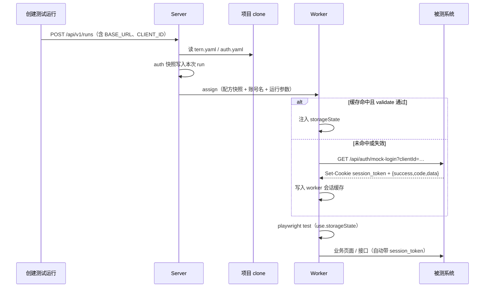

# Tern 登录态管理方案

|      |                                                           |
| ---- | --------------------------------------------------------- |
| 状态 | 已实现（2026-09-17）                                      |
| 日期 | 2026-09-17                                                |
| 范围 | 用例执行前的登录态建立、复用、失效重登、运行期覆盖        |
| 相关 | [architecture.md](./architecture.md) §4（登录与会话管理） |

---

## 1. 概要设计

### 1.1 目标

被测系统需要登录时，登录流程**不写进用例**。项目仓库用一份尽量短的配置描述「怎么登录、有哪些账号」；平台在执行前建立 Playwright `storageState`（cookie + localStorage），用例里的 `page` 自带登录态。

本方案要同时满足：

1. **配置极简**：最常见的接口快捷/后门登录（`GET /api/auth/mock-login?clientId=…`）几行 yaml 就能用。
2. **执行时现读**：配置放在项目仓库，创建测试运行时从当前 clone 读取，不在 sync 时冻进每条用例。
3. **运行期可改值**：token / clientId 过期或换环境，只改本次运行参数，不改仓库。
4. **特殊权限用例**：frontmatter 写一个账号名即可换身份。

### 1.2 非目标（v1 不做）

- 在 Web 上再做一套与 yaml 平行的「登录配置中心」
- 完整 OAuth / 扫码 / 验证码 / TOTP
- 一条用例同时持有两个浏览器身份（那种写在用例里，或拆成两条）
- 把真实密码、token 写进 git

### 1.3 设计原则

| 原则               | 落法                                                                                 |
| ------------------ | ------------------------------------------------------------------------------------ |
| 配方与秘密分离     | yaml 只写「怎么登」；`${ENV:VAR}` 的值来自本次运行参数 / worker 环境                 |
| 约定优于配置       | 不写 `auth:` 的用例走项目默认登录；负向用例显式 `auth: none`                         |
| 一份会话格式       | 三种获取方式（api / form / storage）都产出 Playwright `storageState`，不再发明第四种 |
| 登录一次、按需重登 | 默认每个 worker 在本轮运行里，同一「配方 + 账号 + 环境」只登一次；校验失败再登       |
| 进行中的运行不漂移 | 创建运行时把 auth 配置快照进该 run；改 yaml 只影响下一轮                             |

### 1.4 三层模型

```
登录配方（怎么获得会话）     账号（用谁）           会话（storageState）
tern.yaml / auth.yaml        运行参数 / 环境变量     worker 缓存，可校验
api / form / storage         default / admin / …    注入到用例浏览器
```

---

## 2. API 快捷登录模式（开发/测试环境核心路径）

部分后端系统在开发/测试环境下提供快捷模拟登录端点：

```
GET http://127.0.0.1:3000/api/auth/mock-login?clientId=<uuid>
```

行为特征：

| 项       | 实际行为                                                                                                              |
| -------- | --------------------------------------------------------------------------------------------------------------------- |
| HTTP     | 按 **GET + query**（或 POST + JSON）使用                                                                              |
| 入参     | `clientId`（query；对应一台已绑定账号的设备/客户端）                                                                  |
| 成功     | HTTP 200 + JSON `{ success: true, code: 0, data: LoginInfo }`                                                         |
| 种会话   | `Set-Cookie: session_token=<uuid>`；`Path=/`；`HttpOnly=false`；`Secure=false`；会话 cookie（未设 Domain，host-only） |
| 业务失败 | **仍可能 HTTP 200**，body `{ success: false, code: -10001/-10002/…, msg }`，且不种 cookie。例如设备未授权、未绑定账号 |

因此 api 模式必须同时做到：

1. 支持 **GET** 和 **query**（不能默认只能 POST JSON body）
2. **收集 `Set-Cookie` 写入 storageState**（`session_token` 的 domain 用请求 URL 的 hostname，如 `127.0.0.1`）
3. **不能只看 HTTP 状态码**：`success === false` 或缺少 `session_token` 视为登录失败，把 `msg` 带进 `AuthError`
4. `clientId` 走 `${ENV:CLIENT_ID}`，换设备 / 换权限账号只改运行参数

浏览器后续请求只要带上这份 `storageState`，后端认证拦截器就会从 Cookie `session_token` 还原登录态。

---

## 3. 配置放哪、何时读

项目根目录，按顺序取第一份有效 `auth`：

1. `tern.yaml` / `tern.yml` 的 `auth:`（默认）
2. 同目录 `auth.yaml` / `auth.yml`（有则**整段覆盖** `tern.yaml` 的 `auth`，方便配方较长时把 meta 拆开）

Worker 不接触用例仓库。由 **server 在创建测试运行时**从当前 clone 读取，快照进该 run；派发任务时把解析后的配方随任务下发。

```
sync 用例        → 只记下 frontmatter 的 auth 名（缺省 / 账号名 / none）
创建测试运行     → 读当前仓库 auth 配置，快照进 run
派发一条用例     → 用该 run 快照 + 运行参数解析凭据
worker           → 按缓存键复用会话；validate 失败则按同一配方重登
```

因此：改登录 URL / 账号表 → 推进仓库并拉取，**下一轮运行**生效；改这次的 clientId / token → **只改运行参数**，立刻生效。

---

## 4. 配置形态（由简到繁）

判别：**有顶层 `mode` = 单配方**（推荐）；没有 `mode`、下面全是名字 = 多配方（进阶）。

### 4.1 接口模式单配方（推荐写法）

```yaml
# tern.yaml
name: demo-app
auth:
  mode: api
  method: GET
  url: /api/auth/mock-login # 相对路径拼接运行参数 BASE_URL
  query:
    clientId: ${ENV:CLIENT_ID}
  success:
    cookie: session_token # 响应必须种出该 cookie
    json: success # 可选：JSON 路径为 true（统一响应信封）
  validate: /api/auth/findUserLoginInfo
```

运行参数示例：

```
BASE_URL=http://127.0.0.1:3000
CLIENT_ID=dfe87d72-e89d-4941-8de1-92dffeeb1211
```

绝大多数业务用例 **不写 `auth:`**。未登录 / 登录页负向用例写 `auth: none`。

### 4.2 同一套登录方法、多个身份

要测管理员 / 审计员，用不同 clientId（或不同账号密码），不要复制三份 URL：

```yaml
auth:
  mode: api
  method: GET
  url: /api/auth/mock-login
  query:
    clientId: ${account.clientId}
  success:
    cookie: session_token
  accounts:
    default:
      clientId: ${ENV:CLIENT_ID}
    admin:
      clientId: ${ENV:ADMIN_CLIENT_ID}
    auditor:
      clientId: ${ENV:AUDITOR_CLIENT_ID}
```

用例：

```ts
/**
 * @tern
 * title: 管理员删除订单
 * auth: admin
 */
```

`${account.x}` 从当前账号解析；账号字段本身仍可用 `${ENV:…}`。

### 4.3 登录方法本身不同（进阶场景）

```yaml
auth:
  default:
    mode: api
    method: GET
    url: /api/auth/mock-login
    query: { clientId: ${ENV:CLIENT_ID} }
    success: { cookie: session_token }
  sso-admin:
    mode: form
    loginUrl: /login
    user: '#username'
    pass: '#password'
    submit: '#login-btn'
    username: ${ENV:ADMIN_USER}
    password: ${ENV:ADMIN_PASS}
```

用例写 `auth: sso-admin`。普通项目建议保持单配方。

### 4.4 另外两种 mode（拍平风格）

```yaml
# 页面表单
auth:
  mode: form
  loginUrl: /login
  user: '#username'
  pass: '#password'
  submit: '#login-btn'
  username: ${ENV:USER}
  password: ${ENV:PASS}
  success:
    url: '**/home' # 或 locator: '[data-testid=user-menu]'

# 直写（已有长 token 时）
auth:
  mode: storage
  cookie:
    name: session_token
    value: ${ENV:TOKEN} # domain 缺省从 BASE_URL 推导
```

---

## 5. 字段约定

### 5.1 单配方（有 `mode`）

| 字段                                    | 适用            | 说明                                         |
| --------------------------------------- | --------------- | -------------------------------------------- |
| `mode`                                  | 必填            | `api` \| `form` \| `storage`                 |
| `url`                                   | api             | 登录地址；相对路径拼 `BASE_URL`              |
| `method`                                | api             | 默认 `POST`；快捷登录可用 `GET`              |
| `query`                                 | api             | query string；值可含占位符                   |
| `headers`                               | api             | 可选                                         |
| `body`                                  | api             | JSON body（GET 时忽略）                      |
| `loginUrl` / `user` / `pass` / `submit` | form            | 选择器 + 地址                                |
| `username` / `password`                 | form / 或账号表 | 凭据                                         |
| `cookie` / `cookies` / `localStorage`   | storage         | 直写；`domain`/`origin` 可从 `BASE_URL` 推导 |
| `success`                               | api / form      | 见下                                         |
| `validate`                              | 可选            | 会话校验：URL 路径或 `{ url, cookie }`       |
| `accounts`                              | 可选            | 名 → 键值；缺省名 `default`                  |

`success`（api）：

- `cookie: NAME`：响应 `Set-Cookie` 必须含该 name
- `json: path`：响应 JSON 路径为真值（如 `success`）
- 都不写时：HTTP 2xx **且**至少种出一个 cookie；若 body 是对象且含 `success` 字段，则 `success` 必须为 true（避免业务失败仍 HTTP 200）

`success`（form）：`url` glob 和/或 `locator`。

### 5.2 占位符

| 写法               | 来源                                     |
| ------------------ | ---------------------------------------- |
| `${ENV:VAR}`       | 本次运行参数 ∪ worker 环境               |
| `${account.field}` | 当前选中账号（先解析账号里的 `${ENV:}`） |

缺变量 → 该次执行 `AuthError`，信息含变量名。凭据不进 git、不落库回显。

### 5.3 用例 frontmatter

| 写法          | 含义                                 |
| ------------- | ------------------------------------ |
| （不写）      | 默认配方 + `default` 账号            |
| `auth: none`  | 不要登录态                           |
| `auth: admin` | 单配方下的账号名，或多配方下的配方名 |

禁止在用例里硬编码 URL、选择器、密码、token。

---

## 6. 运行期覆盖（token / clientId 过期）

仓库文件是稳定配方，不是这次的秘密。

| 场景               | 做法                               | 不要               |
| ------------------ | ---------------------------------- | ------------------ |
| 换环境 / 换设备    | 运行参数改 `BASE_URL`、`CLIENT_ID` | 改 yaml 再 commit  |
| 直写 token 过期    | 运行参数带新 `TOKEN`               | 改用例             |
| 本轮全部用管理员   | 运行参数 `AUTH_ACCOUNT=admin`      | 批量改 frontmatter |
| 某条必须用审计账号 | 该用例 `auth: auditor`             | 运行级一刀切       |
| 跑到一半会话失效   | `validate` 失败 → 按原配方重登一次 | 人去改配置         |

约定参数：

- `BASE_URL`：被测系统；相对登录地址、cookie domain 推导都用它
- `AUTH_ACCOUNT`：覆盖「没写 auth 的用例」用哪个账号；**写了 `auth: auditor` 的不被覆盖**
- 配方里声明的 `${ENV:CLIENT_ID}` 等照常从运行参数读取

缓存键包含**解析后的凭据哈希**。本次把 `CLIENT_ID` 换成新的，旧会话不会被复用。

---

## 7. 会话复用与校验

默认 `reuse: worker`：每个 worker 在本 run 内，同一「项目 + 配方 + 账号 + BASE_URL + 凭据哈希」只建立一次会话。

| `reuse`          | 行为                               | 适用                     |
| ---------------- | ---------------------------------- | ------------------------ |
| `worker`（默认） | worker 本地缓存                    | 多 worker 并行、会改数据 |
| `run`            | 第一个 worker 上传 state，其它下载 | 只读冒烟、登录很贵       |
| `never`          | 每条用例都登                       | 会登出 / 改密 / 强隔离   |

流程：

1. 命中缓存 → 注入 storageState
2. 若配置了 `validate`：请求该 URL（带当前 cookie）；HTTP 401/403、跳到登录页、或 JSON `success===false` → 视为失效
3. 失效或未命中 → 按配方登录，写入缓存
4. 用例内改 cookie **不回写**缓存

建议配置 `validate: /api/auth/findUserLoginInfo`（或对应系统心跳端点）。

---

## 8. 执行链路



登录失败（无 cookie、`success=false`、表单未跳转）：该 execution 记 `error` / `AuthError`，api 模式附响应摘要，form 模式附截图 + trace。不要伪装成断言失败。

---

## 9. 关键实现要点（exec-kit）

1. **api 模式使用 Playwright `APIRequestContext`**，按重定向链收集 `Set-Cookie`。
2. **GET + query** 必须可用；`body` 在 GET 时不发送。
3. Cookie 无 `Domain` 时，storageState 的 `domain` = 请求 URL hostname（如 `127.0.0.1`）。
4. 统一响应信封：HTTP 200 不是业务成功判定标准；检查 `success` / `code` / 目标 cookie。
5. 表单登录失败要有截图 + trace（setup 浏览器的产物挂到该 execution）。
6. 缓存目录建议 worker 本地 `tmpdir/tern-auth/<hash>.json`，进程内 Map 亦可；run 结束后清理。
7. 兼容读取：若 yaml 仍是旧形态（`form-login: { mode, form: {…} }`），创建 run 时归一成新拍平结构。
8. **浏览器侧注入走页面自然通道**：新内核 Chromium 对 CDP 写入的 cookie 不随网络请求附带，因此 runner 把缓存的 storageState 以 prologue 注入——先导航到目标站，再用 `document.cookie` / `localStorage` 写入，用例随后的请求即可携带会话。
